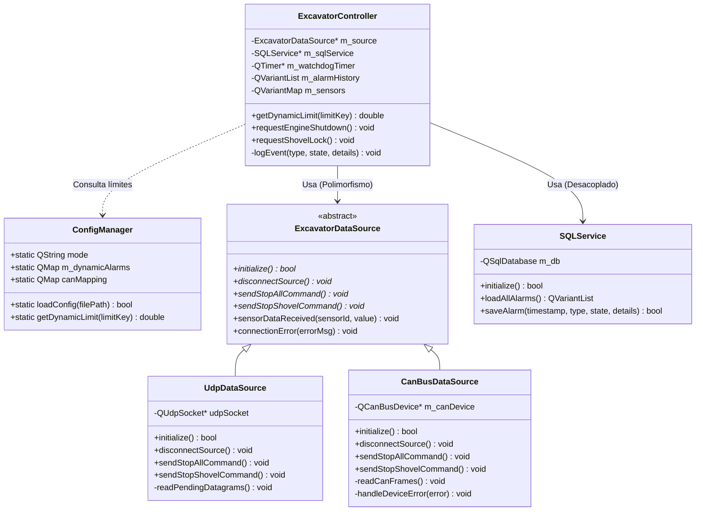
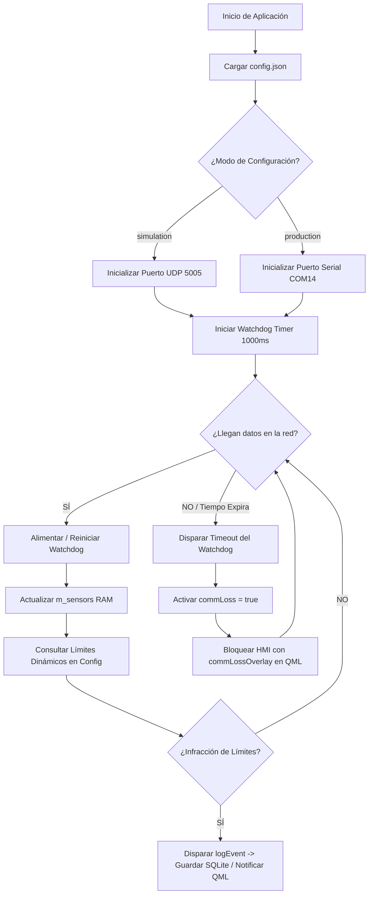

# 🚜 HMI de Telemetría y Control Dinámico para Excavadora Industrial

Este proyecto consiste en una interfaz humano-máquina (**HMI**) industrial y robusta desarrollada en **Qt 6 (C++ y QML)** utilizando una arquitectura **Data-Driven (Guiada por Datos)**. El sistema está diseñado para la monitorización en tiempo real de maquinaria pesada, proporcionando un lazo de control bidireccional y persistencia automatizada de auditorías.

El software es capaz de conmutar dinámicamente entre un entorno de simulación (**red UDP**) y un entorno de producción real (**Bus CAN / protocolo SLCAN**), adaptando su interfaz gráfica (tarjetas analíticas y alertas) de forma automática basándose exclusivamente en un archivo de configuración externa JSON.

---

## 🚀 Características Clave

*   **Arquitectura Guiada por Datos (Data-Driven)**: Agregar o modificar sensores y reglas de alertas no requiere recompilar el código; se autoconfigura editando un archivo `config.json`.
*   **Abstracción de Hardware Polimórfica**: Desacoplamiento completo de las capas mediante interfaces en C++, permitiendo conmutar fuentes físicas (`CanBusDataSource`) y virtuales (`UdpDataSource`).
*   **Diseño Modular en QML**: Interfaz fluida (50Hz) segmentada en pestañas independientes para la Operación Instrumental y la Auditoría Histórica.
*   **Persistencia SQL Desacoplada**: Gestión estructurada de alarmas de sesión a través de un servicio aislado (`SQLService`) conectado a una base de datos local **SQLite**.
*   **Watchdog Timer Integrado**: Mecanismo de seguridad (*Perro Guardián*) que bloquea la HMI mediante un *Overlay* si se interrumpe la ráfaga de datos por más de 1 segundo (1000ms).
*   **Lazo Bidireccional de Emergencia**: Capacidad de inyectar comandos prioritarios de retorno hacia la máquina (`STOP_ALL` / `STOP_SHOVEL`) para detener motores o bloquear actuadores hidráulicos.

---

## 🛠️ Ecosistema Tecnológico y Requisitos

*   **Framework principal**: Qt 6.11.0+ (Módulos: `Quick`, `SerialBus`, `Sql`, `Layouts`).
*   **Compilador**: Microsoft Visual C++ (MSVC 2022 64-bit) u homólogos con soporte **UTF-8** (`/utf-8`).
*   **Herramienta de Construcción**: CMake 3.16+.
*   **Base de Datos**: SQLite 3 (embebido nativo en Qt).
*   **Entorno de Pruebas**: Python 3.10+ (Librerías: `pyserial`, `python-can`).
*   **Puertos Virtuales (Windows)**: Utilería `com0com` configurada con el par cruzado `COM12 <-> COM14`.

---

## 📐 Arquitectura de Bloques y Flujo de Red

El sistema opera bajo un flujo desacoplado donde la interfaz no conoce la procedencia física de los bytes:

[ Maquinaria / Emuladores Python ]│
├── (Modo UDP: JSON Strings @ Puerto 5005) ──► [ UdpDataSource ] ──────┐
││ (Señal Genérica)
└── (Modo CAN: SLCAN Frames @ Puerto COM12) ─► [ CanBusDataSource ] ───┼─► [ ExcavatorController ] ──► [ Interfaz QML ]
│   (Lógica Alertas)            (Render Dinámico)
[ Comandos de Paro / Retorno HMI ]
◄──────────────────────────────────────────┘

---

## 🧬 Diagrama de Clases (Arquitectura C++)

El proyecto sigue patrones de diseño orientados a objetos, implementando **Inyección de Dependencias** y la **Fábrica de Orígenes de Datos** en el punto de entrada de la aplicación (`main.cpp`):



---

## 🔄 Diagramas de Flujo del Sistema

### Lazo de Adquisición y Evaluación del Watchdog
Cada vez que ingresan datos, se alimenta al Perro Guardián de la red. Si el hilo de red calla, la HMI se bloquea.



---

## ⚙️ Estructura del Archivo de Configuración (`config.json`)

El archivo debe ubicarse obligatoriamente en el mismo directorio que el ejecutable compilado:

```json
{
  "mode": "simulation", 
  "udp": {
    "port": 5005,
    "address": "127.0.0.1"
  },
  "can": {
    "interface": "\\\\.\\COM14",
    "plugin": "slcan",
    "mapping": {
      "0x1CFDD600": "inclinacion",
      "0x1CFDD601": "distancia_brazo",
      "0x1CFDD602": "temp_motor",
      "0x1CFDD603": "presion_hidraulica"
    }
  },
  "alarms": {
    "inclinacion_max": 25.0,
    "distancia_brazo_min": 0.8,
    "temp_motor_max": 95.0,
    "presion_hidraulica_max": 210.0
  }
}
```

---

## 📂 Organización de Módulos QML (Front-End)

La interfaz gráfica se encuentra subdividida en componentes reutilizables independientes:

1.  **`Main.qml`**: Estructura base de la aplicación. Maneja el `TabBar` superior, las transiciones del `StackLayout` y la capa de bloqueo del Watchdog (`commLossOverlay`).
2.  **`ExcavatorVisualizer.qml`**: Cuadro gráfico instrumental. Aplica animaciones y rotaciones en matrices 2D al chasis y al brazo hidráulico basándose en la telemetría.
3.  **`TelemetryPanel.qml`**: Cuadrícula responsiva que lee las llaves del mapa de sensores (`Object.keys`) e inyecta dinámicamente tarjetas numéricas digitales en pantalla.
4.  **`AlertPanel.qml`**: Módulo inteligente de alertas. Si un sensor entra en criticidad, genera de forma autónoma una tarjeta roja/naranja expandible con botones de acción inmediata.

---

## 🔧 Pasos para Agregar un Sensor Nuevo en 2 Minutos

Debido a la naturaleza *Data-Driven* del núcleo, añadir instrumentación es una tarea de configuración pura:

1.  **JSON**: Añade el límite del sensor en la sección `"alarms"` de tu `config.json` (ej. `"nivel_combustible_min": 15.0`). Si operas en CAN, añade también su ID binario en `"mapping"`.
2.  **Emulador**: Configura tu script emulador de Python para que empiece a despachar el nuevo payload idéntico a las llaves creadas (ej. `{"id": "nivel_combustible", "val": 45.2}`).
3.  **Resultado**: Al arrancar la HMI, **`TelemetryPanel.qml` dibujará automáticamente la nueva tarjeta digital**, y si el valor infringe el límite, **`AlertPanel.qml` emergerá la alerta en pantalla** y el `SQLService` la guardará en la base de datos SQLite de forma autónoma.

---

## 🛠️ Compilación y Despliegue Manual

### 1. Preparación de Puertos Virtuales (Modo CAN Windows)
Abre el cmd de `com0com` y ejecuta:
```text
install
change CNCA0 PortName=COM12
change CNCB0 PortName=COM4
```

### 2. Compilación del proyecto en C++
Asegúrate de abrir el proyecto desde Qt Creator bajo un compilador configurado con codificación **UTF-8**:
```bash
mkdir build && cd build
cmake .. -DCMAKE_BUILD_TYPE=Debug
cmake --build .
```

### 3. Ejecución de los Scripts Emuladores de Planta
*   **Para el modo Simulación (UDP)**: `python simulador_excavadora.py`
*   **Para el modo Producción (CAN Bus)**: `python emulador_dinamico_can.py`

---

## 📝 Normas de Código y Documentación

Todas las clases de este repositorio se encuentran formalmente comentadas e indexadas siguiendo el estándar **Doxygen** para C++ y **QML Doc** para archivos QML. Para regenerar las páginas web de documentación técnica del proyecto, simplemente ejecuta:
```bash
doxygen Doxyfile
```
